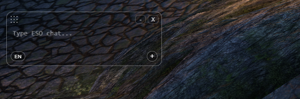
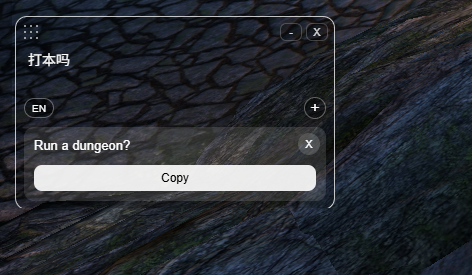

# Tamriel Translator

Tamriel Translator is an AI-powered translation assistant for The Elder Scrolls Online chat. It translates typed messages and chat screenshots between Chinese and English, keeps MMO/ESO terminology understandable, and presents glossary-backed replacement options when a term may have an official in-game name.

The project is built as a full-stack LLM application: a React/Electron desktop overlay, a FastAPI backend, OpenAI text and vision calls, and a SQLite glossary imported from ESO language data.

## Screenshots

The desktop overlay stays compact and always on top while playing:



Translated text appears in the same small window and can be copied back into chat:



## Why It Exists

ESO chat is dense, fast, and full of abbreviations:

```text
lfm vDSR hm need 2dd exp
wts perfect roe 80k
4人本打不打？
Can you help me do Wrath of the Order?
```

A literal translator often misses the player intent, expands abbreviations incorrectly, or leaves named content unexplained. Tamriel Translator focuses on the actual player workflow: quickly understanding chat while staying in game.

## Features

- Translate typed ESO chat between Chinese and English.
- Upload or paste chat screenshots for vision-based extraction and translation.
- Desktop overlay mode with always-on-top window, drag handle, minimize, and close controls.
- Clipboard image support for screenshot workflows.
- Multiple screenshot messages displayed as separate results.
- ESO glossary lookup with longest-match replacement logic.
- Candidate replacement buttons that show both Chinese and English term options.
- Collapsible notes for uncertain or literal translations.
- Abbreviation handling that avoids over-expanding terms like `dd`, `th`, `tank`, and `healer`.
- Render deployment config prepared for a future hosted backend.
- Electron Builder config for Windows desktop packaging.

## Tech Stack

| Layer | Tech |
| --- | --- |
| Frontend | React, TypeScript, Vite |
| Desktop app | Electron |
| Backend | FastAPI, Python |
| LLM API | OpenAI Responses API |
| Database | SQLite, SQLAlchemy |
| Deployment | Render Blueprint |
| Packaging | electron-builder |

## Architecture

```text
Desktop App / Web UI
        |
        | text or screenshot request
        v
FastAPI Backend
        |
        | prompt + image/text
        v
OpenAI Responses API
        |
        | structured JSON
        v
Glossary enrichment + replacement options
        |
        v
Translated chat result
```

The current version is self-hosted. Users run the FastAPI backend with their own OpenAI API key, then use the web UI or desktop app against that backend.

## Installation

### Current Version

The current release does not include a public cloud backend. To use Tamriel Translator, you must run the backend yourself and provide your own OpenAI API key.

The desktop app is a client only. It does not contain an OpenAI API key and cannot translate without a running backend.

### Install From Source

Requirements:

- Python 3.10 or newer
- Node.js and npm
- An OpenAI API key

Clone the repository and install dependencies:

```powershell
git clone https://github.com/pew35/tamriel-translator.git
cd tamriel-translator
py -m pip install -r backend/requirements.txt
cd frontend
npm install
```

## Configure Your OpenAI API Key

The API key belongs in the backend only. Never place it in frontend code, an Electron package, or a Git commit.

Create your local environment file from the example:

```powershell
Copy-Item backend/.env.example backend/.env
```

Then edit `backend/.env`:

```text
OPENAI_API_KEY=your_openai_api_key
OPENAI_MODEL=gpt-5.4-mini
```

Then run the desktop app from source:

```powershell
cd frontend
npm run desktop
```

This starts the local FastAPI backend, reads your key from `backend/.env`, starts the Vite frontend, and opens the desktop overlay.

You can also run the backend and frontend separately using the commands in the Local Development section.

To build a desktop client for a backend you host yourself, set its URL before packaging:

```powershell
cd frontend
$env:VITE_API_BASE_URL="https://your-backend.example.com"
npm run dist
```

## Local Development

### Backend

```powershell
cd backend
py -m pip install -r requirements.txt
```

Create `backend/.env`:

```text
OPENAI_API_KEY=your_api_key
OPENAI_MODEL=gpt-5.4-mini
```

Run the backend:

```powershell
py -m uvicorn main:app --host 127.0.0.1 --port 8001
```

Health check:

```text
http://127.0.0.1:8001/
```

### Frontend

```powershell
cd frontend
npm install
npm run dev
```

Open:

```text
http://127.0.0.1:5173/
```

### Desktop App

```powershell
cd frontend
npm run desktop
```

This starts the local backend and frontend automatically, then opens the always-on-top desktop window.

## Future Hosted Version

The current version does not provide an official hosted backend. A future version is planned to include a cloud backend so users can download the app and use it without running Python or configuring their own OpenAI key.

That version will also need to address API usage costs and abuse prevention, including:

- user accounts or access tokens
- usage quotas and rate limiting
- billing or subscription support
- server-side API key protection
- monitoring and cost controls

The repository already includes `render.yaml` as a starting point for future cloud deployment. The backend creates the SQLite schema on startup and imports glossary data from `backend/glossary_data/*.csv` when the database is empty.

More details are in [DEPLOYMENT.md](DEPLOYMENT.md).

## API Reference

Local base URL:

```text
http://127.0.0.1:8001
```

FastAPI interactive documentation:

```text
http://127.0.0.1:8001/docs
```

| Method | Endpoint | Content type | Purpose |
| --- | --- | --- | --- |
| `GET` | `/` | - | Health check |
| `POST` | `/translate-text` | `application/json` | Translate typed chat text |
| `POST` | `/translate-screenshot` | `multipart/form-data` | Extract and translate chat messages from an image |

Supported directions:

- `zh_to_en`
- `en_to_zh`

### Translate Text

Request:

```json
{
  "text": "4人本打不打？",
  "direction": "zh_to_en"
}
```

Example:

```powershell
curl.exe -X POST "http://127.0.0.1:8001/translate-text" `
  -H "Content-Type: application/json" `
  -d "{\"text\":\"4人本打不打？\",\"direction\":\"zh_to_en\"}"
```

### Translate Screenshot

The `image` field accepts PNG, JPG, JPEG, or WebP files.

```powershell
curl.exe -X POST "http://127.0.0.1:8001/translate-screenshot" `
  -F "direction=en_to_zh" `
  -F "image=@sample-images/c-group.png"
```

### Response Shape

Both translation endpoints return the same structured response:

```json
{
  "inputType": "text",
  "direction": "zh_to_en",
  "messages": [
    {
      "speaker": "",
      "original": "4人本打不打？",
      "translation": "Run a dungeon?",
      "notes": [],
      "copyText": "Run a dungeon?",
      "candidateTerms": [],
      "glossaryMatches": [],
      "replacementOptions": []
    }
  ]
}
```

## Build a Windows App

From `frontend/`:

```powershell
npm run dist
```

To point the packaged app at a custom cloud backend:

```powershell
$env:VITE_API_BASE_URL="https://your-render-service.onrender.com"
npm run dist
```

Build outputs are written to:

```text
frontend/release/
```

## Project Status

This is a working MVP aimed at demonstrating practical LLM application development:

- multimodal input
- structured model output
- domain-specific prompting
- glossary/database enrichment
- desktop app packaging
- cloud deployment preparation

The next useful improvements are a hosted backend, usage billing, rate limiting, user access control, better installer signing, UI polish, and a more complete evaluation set for ESO chat examples.

## Notes

API keys should never be included in the desktop app or committed to Git. In the current self-hosted version, each user is responsible for their own backend and OpenAI API usage.
